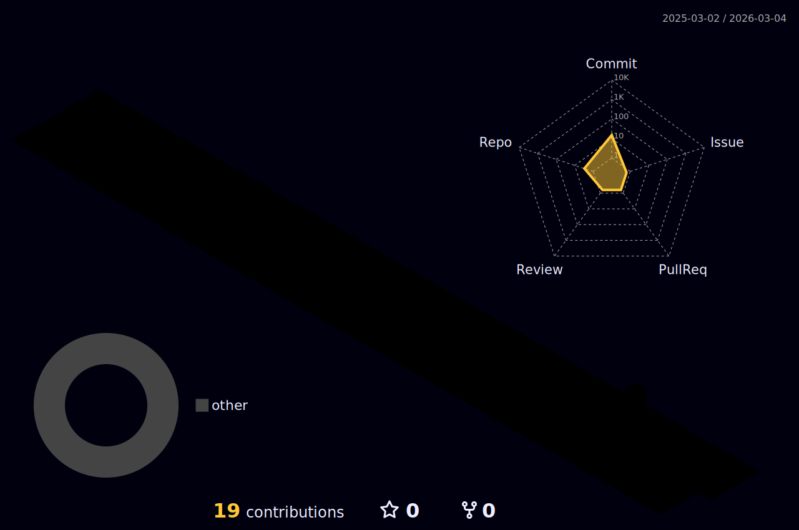

  

  ### ⚡ Senior Full-Stack Developer | Arch & NixOS Power User
  
  

---

### 🛠 The Tech Stack

**🖥️ OS & Desktop Environments**

**🗄️ Backend & Cloud Infrastructure**

**🚀 Frontend & Tools**

---

### 📂 Featured Production Projects

| Project | Stack | Description |
| :--- | :--- | :--- |
| **🛡️ [Aether Shield](https://aether-shield.vercel.app)** | Next.js + Cloud | Advanced E-commerce & Shielding solution. |
| **🏭 [Moti Plastic](https://motiplastic-co.vercel.app)** | Full-Stack | Industrial B2B E-commerce platform. |
| **👟 [Puma E-Com](https://puma-ecom.vercel.app)** | Firebase + React | High-performance retail experience. |
| **🎲 [Bingo IO](https://bingo-io.vercel.app)** | Real-time | Interactive gaming & web platform. |
| **🌐 [Portfolio](https://19-hasan.vercel.app)** | Next.js | Modern personal landing page. |

---

### 📊 System Diagnostics

  
  

---

### 🌌 3D Contribution Universe

  

---

  

